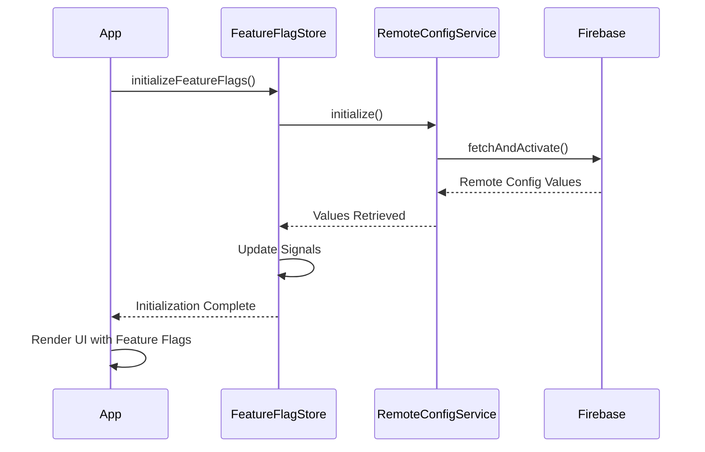

# Feature Flags - Firebase Remote Config

## Descripción

La aplicación utiliza **Firebase Remote Config** para controlar dinámicamente características de la aplicación sin necesidad de desplegar nuevas versiones. Esto permite:

- ✅ Activar/desactivar funcionalidades remotamente
- ✅ Realizar pruebas A/B
- ✅ Despliegue gradual de funcionalidades
- ✅ Respuesta rápida ante problemas en producción

## Feature Flags Implementados

### 1. `appTitle` (String)
**Tipo:** `string`  
**Valor por defecto:** `"Mis Tareas"`  
**Descripción:** Controla el título principal de la aplicación mostrado en el header.

**Uso:**
```typescript
// En el componente
readonly appTitle = this.featureFlagStore.appTitle;

// En el template
<ion-title>{{ appTitle() }}</ion-title>
```

**Firebase Remote Config:**
```json
{
  "appTitle": "Mi Lista de Tareas"
}
```

---

### 2. `maxTasks` (Number)
**Tipo:** `number`  
**Valor por defecto:** `200`  
**Descripción:** Define el límite máximo de tareas que un usuario puede crear. Al alcanzar el límite, se muestra un mensaje de alerta.

**Uso:**
```typescript
// Validación en TaskStore
const maxTasks = this.featureFlagStore.maxTasksLimit();
const currentTaskCount = this._tasks().length;

if (currentTaskCount >= maxTasks) {
  throw new Error(`Maximum limit of ${maxTasks} tasks reached.`);
}
```

**Firebase Remote Config:**
```json
{
  "maxTasks": 100
}
```

**Comportamiento:**
- Si el usuario intenta crear una tarea cuando ya alcanzó el límite, se muestra un alert
- El límite se valida tanto en el store como en la UI

---

### 3. `enableDeleteTask` (Boolean)
**Tipo:** `boolean`  
**Valor por defecto:** `true`  
**Descripción:** Controla si los usuarios pueden eliminar tareas y categorías. Útil para prevenir eliminaciones accidentales o durante mantenimiento.

**Uso:**
```typescript
// En el componente
readonly deleteTaskEnabled = this.featureFlagStore.deleteTaskEnabled;

// En el template
<lib-task-card 
  [showActions]="deleteTaskEnabled()"
  ...>
</lib-task-card>

<ion-item-option *ngIf="deleteTaskEnabled()" color="danger">
  <ion-icon name="trash"></ion-icon>
</ion-item-option>
```

**Firebase Remote Config:**
```json
{
  "enableDeleteTask": false
}
```

**Efectos cuando está deshabilitado:**
- Oculta botones de eliminación en TaskCard
- Oculta opciones de eliminar en listas de categorías
- Los métodos de eliminación aún funcionan (solo oculta UI)

---

### 4. `showStatistics` (Boolean)
**Tipo:** `boolean`  
**Valor por defecto:** `true`  
**Descripción:** Controla la visibilidad de las secciones de estadísticas y resúmenes en la aplicación.

**Uso:**
```typescript
// En el componente
readonly statisticsVisible = this.featureFlagStore.statisticsVisible;

// En el template
<div class="stats-container" *ngIf="statisticsVisible()">
  <lib-stat-card ...></lib-stat-card>
  <lib-stat-card ...></lib-stat-card>
</div>

<ion-card *ngIf="stats() && !loading() && statisticsVisible()">
  <!-- Category Statistics -->
</ion-card>
```

**Firebase Remote Config:**
```json
{
  "showStatistics": false
}
```

**Efectos cuando está deshabilitado:**
- Oculta las tarjetas de estadísticas en la lista de tareas
- Oculta el card de estadísticas en la página de categorías
- Reduce el uso de recursos al no calcular/renderizar stats

---

### 5. `enableCategories` (Boolean)
**Tipo:** `boolean`  
**Valor por defecto:** `true`  
**Descripción:** Feature flag preexistente para controlar la funcionalidad de categorías.

**Firebase Remote Config:**
```json
{
  "enableCategories": true
}
```

---

## Configuración de Firebase Remote Config

### 1. Crear Feature Flags en Firebase Console

1. Ve a **Firebase Console** → Tu Proyecto → **Remote Config**
2. Haz clic en **Add parameter**
3. Configura cada parámetro:

#### appTitle
```
Parameter key: appTitle
Data type: String
Default value: "Mis Tareas"
Description: Título de la aplicación mostrado en el header
```

#### maxTasks
```
Parameter key: maxTasks
Data type: Number
Default value: 200
Description: Límite máximo de tareas por usuario
```

#### enableDeleteTask
```
Parameter key: enableDeleteTask
Data type: Boolean
Default value: true
Description: Habilita o deshabilita la opción de eliminar tareas
```

#### showStatistics
```
Parameter key: showStatistics
Data type: Boolean
Default value: true
Description: Muestra u oculta las secciones de estadísticas
```

#### enableCategories
```
Parameter key: enableCategories
Data type: Boolean
Default value: true
Description: Habilita o deshabilita la funcionalidad de categorías
```

### 2. Publicar Cambios

Después de configurar todos los parámetros, haz clic en **"Publish changes"** para que los cambios estén disponibles.

### 3. Configurar Condiciones (Opcional)

Puedes crear condiciones para aplicar diferentes valores según:
- **Porcentaje de usuarios:** Para pruebas A/B o despliegue gradual
- **Región:** Diferentes configuraciones por país
- **Versión de la app:** Activar features solo en versiones específicas
- **Plataforma:** iOS vs Android

Ejemplo de condición:
```
Condition: beta_users
Rule: User in audience "Beta Testers"

Parameter: maxTasks
Conditional value: 500
Default value: 200
```

---

## Arquitectura de Feature Flags

### 1. RemoteConfigService
**Ubicación:** `src/app/infrastructure/services/remote-config.service.ts`

Servicio de infraestructura que se comunica con Firebase Remote Config.

**Responsabilidades:**
- Inicializar Firebase Remote Config
- Obtener valores de configuración
- Manejar errores y reintentos
- Forzar actualización de valores

**Métodos principales:**
```typescript
initialize(): Promise<boolean>
getFeatureFlag(key: string, defaultValue: boolean): Promise<boolean>
getNumberValue(key: string, defaultValue: number): Promise<number>
getStringValue(key: string, defaultValue: string): Promise<string>
forceFetch(): Promise<boolean>
```

### 2. FeatureFlagStore
**Ubicación:** `src/app/presentation/stores/feature-flag.store.ts`

Store reactivo que gestiona el estado de los feature flags usando Angular Signals.

**Responsabilidades:**
- Cargar feature flags al iniciar la app
- Proporcionar signals reactivos para cada flag
- Actualizar la UI automáticamente cuando cambian los valores
- Manejar estados de loading y error

**Signals expuestos:**
```typescript
// Estado
readonly featureFlags: Signal<FeatureFlags>
readonly loading: Signal<boolean>
readonly error: Signal<string | null>
readonly initialized: Signal<boolean>

// Selectores computados
readonly appTitle: Signal<string>
readonly maxTasksLimit: Signal<number>
readonly deleteTaskEnabled: Signal<boolean>
readonly statisticsVisible: Signal<boolean>
readonly categoriesEnabled: Signal<boolean>
```

### 3. Integración en Componentes

Los componentes inyectan el `FeatureFlagStore` y consumen los signals:

```typescript
export class TaskListComponent {
  private readonly featureFlagStore = inject(FeatureFlagStore);
  
  readonly deleteTaskEnabled = this.featureFlagStore.deleteTaskEnabled;
  readonly statisticsVisible = this.featureFlagStore.statisticsVisible;
  readonly maxTasksLimit = this.featureFlagStore.maxTasksLimit;
}
```

---

## Flujo de Inicialización



### 1. App Component Startup
```typescript
// app.component.ts o mobile-app/src/app/app.component.ts
async ngOnInit() {
  await this.featureFlagStore.initializeFeatureFlags();
  console.log('Feature flags initialized:', this.featureFlagStore.featureFlags());
}
```

### 2. Loading Feature Flags
```typescript
// feature-flag.store.ts
async initializeFeatureFlags(): Promise<void> {
  this._loading.set(true);
  
  // Initialize Remote Config
  await this.remoteConfigService.initialize();
  
  // Fetch all flags in parallel
  const [appTitle, maxTasks, enableDeleteTask, showStatistics] = await Promise.all([
    this.remoteConfigService.getStringValue('appTitle', 'Mis Tareas'),
    this.remoteConfigService.getNumberValue('maxTasks', 200),
    this.remoteConfigService.getFeatureFlag('enableDeleteTask', true),
    this.remoteConfigService.getFeatureFlag('showStatistics', true)
  ]);
  
  // Update signals
  this._featureFlags.set({ appTitle, maxTasks, enableDeleteTask, showStatistics, ... });
  this._initialized.set(true);
  this._loading.set(false);
}
```

### 3. UI Reactivity
Los componentes reaccionan automáticamente a cambios en los signals:

```typescript
// template
<div *ngIf="statisticsVisible()">
  <!-- Statistics cards -->
</div>
```

Cuando `statisticsVisible()` cambia de `true` a `false`, Angular automáticamente oculta el contenido.

---

## Testing

### Unit Tests

Los tests validan el comportamiento con diferentes valores de feature flags:

```typescript
// feature-flag.store.spec.ts
it('should have default feature flags', () => {
  const flags = store.featureFlags();
  expect(flags.appTitle).toBe("Mis Tareas");
  expect(flags.maxTasks).toBe(200);
  expect(flags.enableDeleteTask).toBe(true);
  expect(flags.showStatistics).toBe(true);
});

it('should have computed selectors', () => {
  expect(store.appTitle()).toBe("Mis Tareas");
  expect(store.maxTasksLimit()).toBe(200);
  expect(store.deleteTaskEnabled()).toBe(true);
  expect(store.statisticsVisible()).toBe(true);
});
```

### Mocks para Testing

```typescript
// __mocks__/firebase.mock.ts
const mockRemoteConfigService = {
  initialize: jest.fn().mockResolvedValue(true),
  getFeatureFlag: jest.fn().mockResolvedValue(true),
  getNumberValue: jest.fn().mockResolvedValue(200),
  getStringValue: jest.fn().mockResolvedValue('Test Title')
};
```

---

## Mejores Prácticas

### 1. **Valores por Defecto Sensatos**
Siempre proporciona valores por defecto que mantengan la app funcional si Firebase no está disponible:

```typescript
const DEFAULT_FEATURE_FLAGS: FeatureFlags = {
  enableCategories: true,      // Funcionalidad básica habilitada
  enableDeleteTask: true,       // Operación normal permitida
  appTitle: "Mis Tareas",      // Título genérico pero funcional
  maxTasks: 200,               // Límite razonable
  showStatistics: true         // Features adicionales habilitadas
};
```

### 2. **Manejo de Errores**
El store maneja errores gracefully y usa valores por defecto:

```typescript
try {
  const flags = await fetchFeatureFlags();
  this._featureFlags.set(flags);
} catch (error) {
  console.error('Failed to load feature flags:', error);
  this._featureFlags.set(DEFAULT_FEATURE_FLAGS);
  this._initialized.set(true); // Mark as initialized to prevent infinite retries
}
```

### 3. **Loading States**
Muestra indicadores de carga mientras se obtienen los feature flags:

```typescript
<ion-spinner *ngIf="loading()"></ion-spinner>
<div *ngIf="!loading() && initialized()">
  <!-- Content -->
</div>
```

### 4. **Refresh Manual**
Permite a los usuarios forzar actualización de feature flags:

```typescript
async refreshFeatureFlags(): Promise<void> {
  await this.remoteConfigService.forceFetch();
  this._initialized.set(false);
  await this.initializeFeatureFlags();
}
```

### 5. **Debug Information**
Proporciona herramientas para debug en desarrollo:

```typescript
getDebugInfo(): { flags: FeatureFlags; remoteValues: unknown } {
  return {
    flags: this._featureFlags(),
    remoteValues: this.remoteConfigService.getAllValues()
  };
}
```

---

## Casos de Uso

### Escenario 1: Despliegue Gradual
Quieres lanzar la funcionalidad de estadísticas solo al 10% de usuarios:

**Firebase Console:**
```
Parameter: showStatistics
Condition: 10% de usuarios
  Value: true
Default value: false
```

### Escenario 2: Respuesta a Incidente
Hay un bug en la eliminación de tareas, necesitas deshabilitarla inmediatamente:

**Firebase Console:**
1. Cambia `enableDeleteTask` a `false`
2. Publica los cambios
3. Los usuarios verán el cambio en la próxima inicialización de la app

### Escenario 3: Promoción Especial
Durante un evento, quieres aumentar el límite de tareas:

**Firebase Console:**
```
Parameter: maxTasks
Condition: Durante evento (fecha específica)
  Value: 500
Default value: 200
```

### Escenario 4: Personalización por Región
Diferentes títulos para diferentes regiones:

**Firebase Console:**
```
Parameter: appTitle
Condition: Region == "ES"
  Value: "Mis Tareas"
Condition: Region == "US"
  Value: "My Tasks"
Condition: Region == "FR"
  Value: "Mes Tâches"
```

---

## Troubleshooting

### Los cambios en Firebase no se reflejan en la app

**Causas comunes:**
1. **Cache de Remote Config:** Firebase cachea valores por 12 horas por defecto
2. **App no reiniciada:** Los feature flags solo se cargan en el `ngOnInit` del AppComponent
3. **Cambios no publicados:** Verifica que hayas hecho clic en "Publish changes"

**Soluciones:**
```typescript
// Forzar actualización (solo para desarrollo)
async forceFetch(): Promise<boolean> {
  const settings = {
    minimumFetchIntervalMillis: 0 // Solo en desarrollo
  };
  // ... resto del código
}

// En producción, usa intervalos razonables (12 horas es el valor recomendado)
```

### TypeError: Cannot read property 'appTitle' of undefined

**Causa:** Intentando acceder a feature flags antes de que se inicialicen.

**Solución:**
```typescript
// Verifica initialized signal
<div *ngIf="featureFlagStore.initialized()">
  {{ featureFlagStore.appTitle() }}
</div>

// O usa valores por defecto
readonly appTitle = computed(() => 
  this.featureFlagStore.appTitle() || 'Default Title'
);
```

---

## Monitoreo y Analytics

### Registrar Uso de Feature Flags

```typescript
// En RemoteConfigService
getFeatureFlag(key: string, defaultValue: boolean): Promise<boolean> {
  const value = await getValue(this.remoteConfig, key).asBoolean();
  
  // Log para analytics
  console.log(`Feature flag '${key}' evaluated to: ${value}`);
  
  return value;
}
```

### Integración con Firebase Analytics

```typescript
import { logEvent } from '@angular/fire/analytics';

// Registrar cuando se usa un feature flag
if (this.deleteTaskEnabled()) {
  logEvent(this.analytics, 'feature_delete_task_enabled');
}
```

---

## Migración de Feature Flags

Si necesitas remover un feature flag después de que una funcionalidad está completamente desplegada:

### 1. Establecer valor permanente en código
```typescript
// Antes
[showActions]="deleteTaskEnabled()"

// Después
[showActions]="true"
```

### 2. Remover del store
```typescript
// Remover del interface FeatureFlags
// Remover computed signal
// Remover del fetch en initializeFeatureFlags
```

### 3. Limpiar en Firebase Console
- Eliminar el parámetro de Remote Config

---

## Referencias

- [Firebase Remote Config Documentation](https://firebase.google.com/docs/remote-config)
- [Angular Signals Guide](https://angular.dev/guide/signals)
- [Feature Flag Best Practices](https://martinfowler.com/articles/feature-toggles.html)
